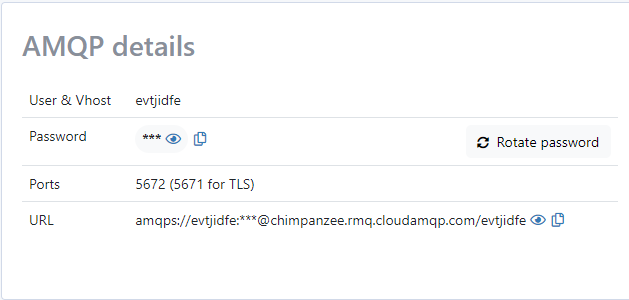
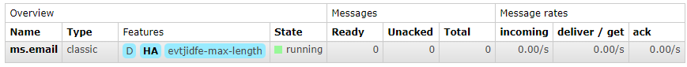
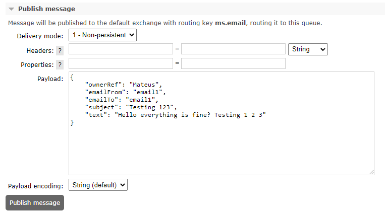
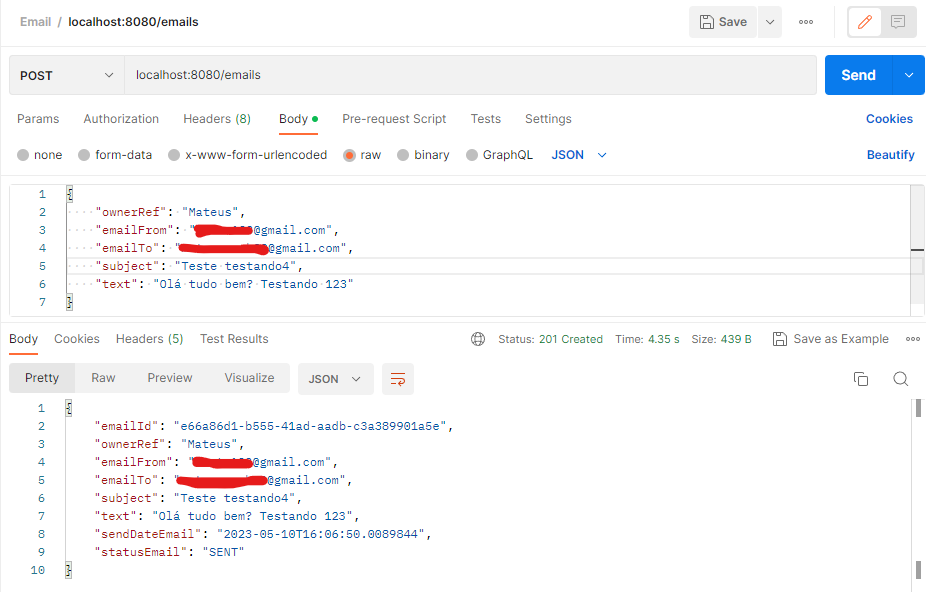
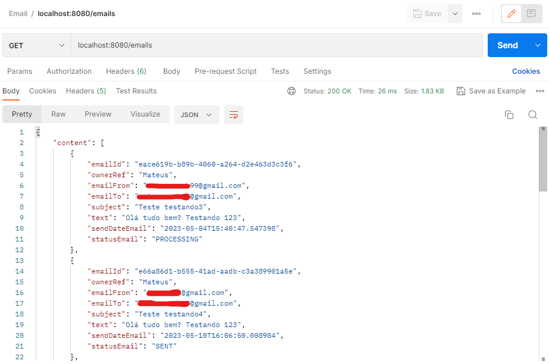
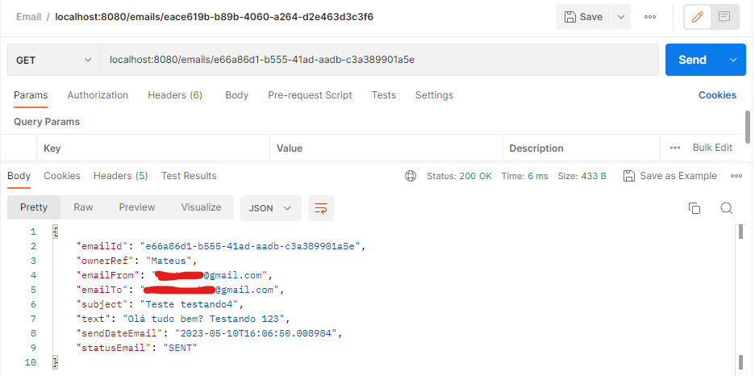
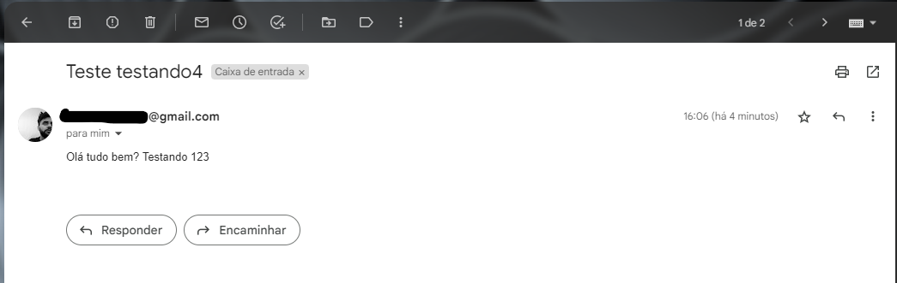

# Email Sending Project

The objective of this project is to demonstrate how to send and receive messages using Spring and RabbitMQ.

RabbitMQ is an open source messaging software that allows communication between different systems, languages and platforms in an efficient and scalable way. It uses the AMQP (Advanced Message Queuing Protocol) protocol to transfer messages between different components of a distributed system.

Spring is a framework for developing Java applications that supports many aspects of application development, such as dependency injection, data persistence, security, and more. It also provides integration with RabbitMQ for sending and receiving messages.

The aim of this project is therefore to demonstrate how to use Spring and RabbitMQ to send and receive messages in a distributed system. This is useful in scenarios where it is necessary to integrate different components of a system, which may be written in different languages or platforms, or even in different instances of the same distributed application.

The project was developed along with classes taught by Michelli Brito on her YouTube channel.
- [MICROSERVICES WITH JAVA SPRING](https://www.youtube.com/watch?v=LW-N44fZ1wk&list=PL8iIphQOyG-Dp037UnFG0x8aduelvZZWE)


## Technologies Used
The technologies used in this project are:
- Java
- Spring boot
- RabbitMQ

## Functionalities
- Send email
- Find all emails
- Find an email by id

## Settings
### Spring Mail

1. In this project we are going to use Gmail's smtp
2. To make things easier, you'll need to change the `username` and `password` in `application.properties`;

```json
spring.mail.username=email@gmail.com
spring.mail.password=*****************
```
- `username` is the root of the email you are using to send emails;
- `password` is a specific 16-digit code generated by google;

4. To generate the `password` just follow this step by step available at [Sign in with app passwords](https://support.google.com/accounts/answer/185833)
5. After generating the password, just copy and paste it into `spring.mail.password`

### Spring RabbitMQ

1. Create an account on the CloudAMQP platform, here we will create an instance of RabbitMQ to connect our email service
2. After connecting to the platform, click on `Create new Instance`;
3. In `Name` put what you want. For example "project-ms-email"
4. In Plan leave it in `Free`
5. In `Region` you can leave the default and then just click on `Create Instance`
6. With the instance created, enter it and you will find something like this:

<p align="center">
  
</p>

7. Go to the `application.properties` file and copy the instance url and paste it here

```json
spring.rabbitmq.addresses=amqps:<***** AMQP URL ******>
spring.rabbitmq.template.queue=ms.email
```
<br>

- [CloudAMQP Platform](https://www.cloudamqp.com/)
- [Spring AMQP Documentation ](https://docs.spring.io/spring-amqp/docs/current/reference/html/)

<br>

## Running

You can run it in two ways:

1 Option - If your environment is correctly configured for the corresponding Java version, PostgreSQL and RabbitMQ. Just run in an ide of your choice.

2 Option - Run through docker, having docker on your machine and making the settings correctly, open your terminal at the root of the project and run the command `docker-compose up -d`

The application will be available at "http://localhost:8080".

### Testing through messaging

1. Back on the CloudAMQP platform, enter your instance
2. Click on `RabbitMQ Manager`
3. Go to `Queues`
4. Click on the `ms-email` queue

<p align="center">
  
</p>

5. Scroll to `Publish message`
6. Enter the data and click on `Publish message`

<p align="center">
  
</p>

<br>

### Testing through Postman

<p align="center">
  
  <p align="center">Figure 1: Send email</p>
</p>

<p align="center">
  
  <p align="center">Figure 2: Find all emails</p>
</p>

<p align="center">
  
  <p align="center">Figure 3: Find an email by id</p>
</p>

<p align="center">
  
  <p align="center">Figure 4: Result</p>
</p>
